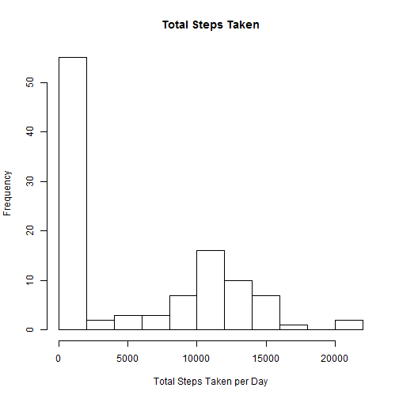
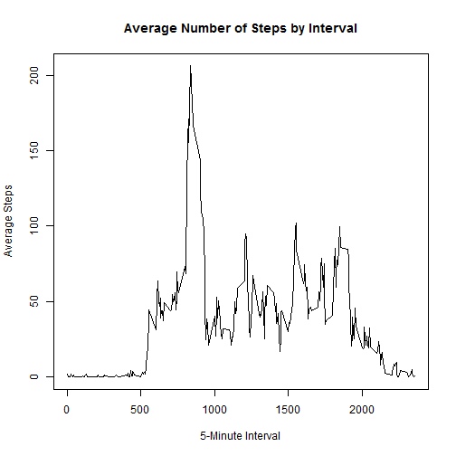
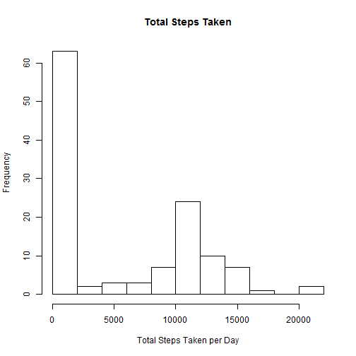
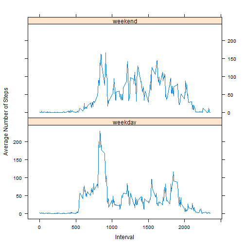

Programming Assignment 1
===================================

###Loading and preprocessing the data


```r
activity <- read.csv("activity.csv", header = TRUE)

summary(activity)
```

```
##      steps                date          interval     
##  Min.   :  0.00   2012-10-01:  288   Min.   :   0.0  
##  1st Qu.:  0.00   2012-10-02:  288   1st Qu.: 588.8  
##  Median :  0.00   2012-10-03:  288   Median :1177.5  
##  Mean   : 37.38   2012-10-04:  288   Mean   :1177.5  
##  3rd Qu.: 12.00   2012-10-05:  288   3rd Qu.:1766.2  
##  Max.   :806.00   2012-10-06:  288   Max.   :2355.0  
##  NA's   :2304     (Other)   :15840
```

###What is mean total number of steps taken per day?

1) Calculate the total number of steps taken per day

The total number of steps take per day is:


```r
##Get rid of null values
activity.no.na <- na.omit(activity)
##Aggregate steps by date
total.steps <- aggregate(activity.no.na$steps, by=list(Category=activity.no.na$dat), FUN=sum)
date <- total.steps[,1]
total.steps.taken <- total.steps[,2]
total.steps <- cbind(date, total.steps.taken)
```

    
2) If you do not understand the difference between a histogram and a barplot, research the difference between them. Make a histogram of the total number of steps taken each day


```r
hist(total.steps, xlab = "Total Steps Taken per Day", main = "Total Steps Taken")
```

 

3) Calculate and report the mean and median of the total number of steps taken per day

The mean number of steps taken per day is:


```r
mean.steps <- mean(total.steps[,2])
mean.steps
```

```
## [1] 10766.19
```

The median number of steps taken per day is:


```r
median.steps <- median(total.steps[,2])
median.steps
```

```
## [1] 10765
```


###What is the average daily activity pattern?

1) Make a time series plot (i.e. type = "l") of the 5-minute interval (x-axis) and the average number of steps taken, averaged across all days (y-axis)


```r
##Find the average number of steps by interval, averaged across all dates
avg.steps <- aggregate(activity.no.na$steps, by=list(Category=activity.no.na$interval), FUN=mean)
interval <- avg.steps[,1]
steps <- as.numeric(avg.steps[,2])
avg.steps <- as.data.frame(cbind(interval, steps))

##Create a time series plot
plot(avg.steps[,1], avg.steps[,2], type = "l",
     main = "Average Number of Steps by Interval",
     xlab = "5-Minute Interval",
     ylab = "Average Steps")
```

 

2) Which 5-minute interval, on average across all the days in the dataset, contains the maximum number of steps?


The 5-minute interval that contains the maximum number of steps on average across all the days in the data set is 835:


```r
max.steps <- max(avg.steps$steps)
avg.steps[avg.steps$steps == max.steps,]
```

```
##     interval    steps
## 104      835 206.1698
```

###Imputing missing values

1) Calculate and report the total number of missing values in the dataset (i.e. the total number of rows with NAs)

There are 2,304 total rows with missing values in the dataset:


```r
null.steps <- is.na(activity$steps)
table(null.steps)
```

```
## null.steps
## FALSE  TRUE 
## 15264  2304
```

2) Devise a strategy for filling in all of the missing values in the dataset. The strategy does not need to be sophisticated. For example, you could use the mean/median for that day, or the mean for that 5-minute interval, etc.

To solve this problem, I added a fourth column to the data frame called "steps.no.null".  This column is equal to the steps value when it is not null, and is equal to the average steps for the given 5-minute interval when the it is null.


```r
##Again, use avg.steps, which gives the average total steps by interval
avg.steps <- aggregate(activity.no.na$steps, by=list(Category=activity.no.na$interval), FUN=mean)
interval <- avg.steps[,1]
steps <- as.numeric(avg.steps[,2])
avg.steps <- as.data.frame(cbind(interval, steps))

##Create new data with null values replaced by average steps for the interval
##Create a vector to store the replacement values
steps.no.null <- rep(NA,length(activity$steps))

##If activity$steps[i] is null, set steps.no.null[i] equal to the average steps for that interval
##Otherwise set steps.no.null[i] equal to activity$steps[i]
for(i in 1:length(steps.no.null)){
      if(is.na(activity[i,1]) == TRUE){
            steps.no.null[i] <- avg.steps[avg.steps$interval == activity[i,3],2]
      } else {
            steps.no.null[i] <- activity[i,1]
      }
}

##Bind steps.no.null to the activity data frame
activity2 <- cbind(activity, steps.no.null)
```

3) Create a new dataset that is equal to the original dataset but with the missing data filled in.


```r
activity3 <- cbind(activity2[,4], activity2[,2:3])
colnames(activity3) <-c("steps","date","interval")
```

4) Make a histogram of the total number of steps taken each day and Calculate and report the mean and median total number of steps taken per day. Do these values differ from the estimates from the first part of the assignment? What is the impact of imputing missing data on the estimates of the total daily number of steps?


```r
total.steps.2 <- aggregate(activity3$steps, by=list(Category=activity3$date), FUN=sum)
date <- total.steps.2[,1]
total.steps.taken <- total.steps.2[,2]
total.steps.2 <- cbind(date, total.steps.taken)

hist(total.steps.2, xlab = "Total Steps Taken per Day", main = "Total Steps Taken")
```

 

The new mean is equal to the mean calculated in the first part of the assignment, and the median is greater than the media calculated in the first part of the assignment:


```r
##Calculate the new means and medians and see if they're different from the old values
mean.steps.2 <- mean(total.steps.2[,2])
mean.steps.2
```

```
## [1] 10766.19
```

```r
##Is the new mean different from the old mean?
if(mean.steps.2 == mean.steps){
        "New mean is equal to the old mean"
} else if(mean.steps.2 > mean.steps){
        "New mean is greater than old mean"
} else {
        "New mean is less than old mean"
}
```

```
## [1] "New mean is equal to the old mean"
```

```r
median.steps.2 <- median(total.steps.2[,2])
median.steps.2
```

```
## [1] 10766.19
```

```r
##Is the new median different from the old median?
if(median.steps.2 == median.steps){
        "New median is equal to the old median"
} else if(median.steps.2 > median.steps){
        "New median is greater than old median"
} else {
        "New median is less than old median"
}
```

```
## [1] "New median is greater than old median"
```

###Are there differences in activity patterns between weekdays and weekends?

1) Create a new factor variable in the dataset with two levels - "weekday" and "weekend" indicating whether a given date is a weekday or weekend day.


```r
weekday <- rep(NA,length(activity3$steps))

for(i in 1:length(weekday)){
        if(weekdays(as.Date(activity3[i,2], format = "%Y-%m-%d")) == "Saturday"){
                weekday[i] <- "weekend"
        } else if(weekdays(as.Date(activity3[i,2], format = "%Y-%m-%d")) == "Sunday"){
                weekday[i] <- "weekend"
        } else {
                weekday[i] <- "weekday"
        }
}

activity3 <- cbind(activity3, weekday)
colnames(activity3) <-c("steps","date","interval","weekday")

summary(activity3)
```

```
##      steps                date          interval         weekday     
##  Min.   :  0.00   2012-10-01:  288   Min.   :   0.0   weekday:12960  
##  1st Qu.:  0.00   2012-10-02:  288   1st Qu.: 588.8   weekend: 4608  
##  Median :  0.00   2012-10-03:  288   Median :1177.5                  
##  Mean   : 37.38   2012-10-04:  288   Mean   :1177.5                  
##  3rd Qu.: 27.00   2012-10-05:  288   3rd Qu.:1766.2                  
##  Max.   :806.00   2012-10-06:  288   Max.   :2355.0                  
##                   (Other)   :15840
```

2) Make a panel plot containing a time series plot (i.e. type = "l") of the 5-minute interval (x-axis) and the average number of steps taken, averaged across all weekday days or weekend days (y-axis). See the README file in the GitHub repository to see an example of what this plot should look like using simulated data.


```r
library(lattice)

avg.steps.weekday <- aggregate(activity3$steps, by=list(Category=activity3$interval, activity3$weekday), FUN=mean)
colnames(avg.steps.weekday) <- c("interval","weekday","avg.steps")

xyplot(avg.steps.weekday$avg.steps ~ avg.steps.weekday$interval | avg.steps.weekday$weekday,
       type = "l", layout = c(1,2),
       xlab = "Interval",
       ylab = "Average Number of Steps")
```

 
